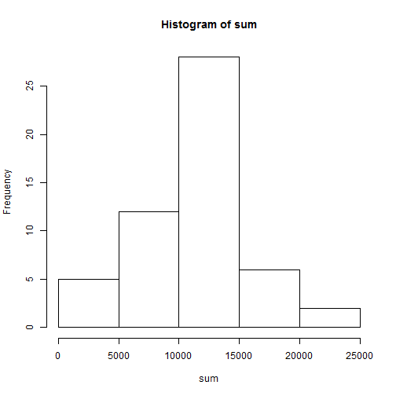
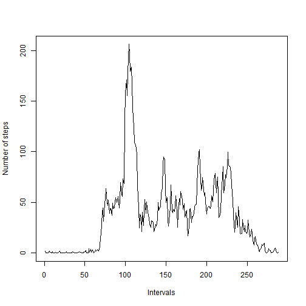
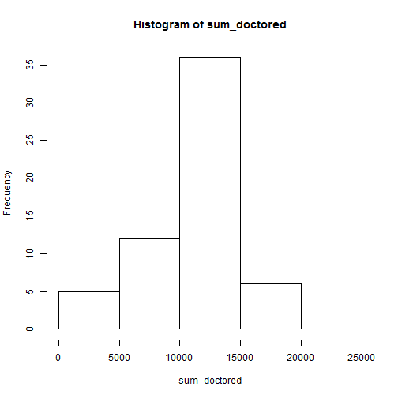
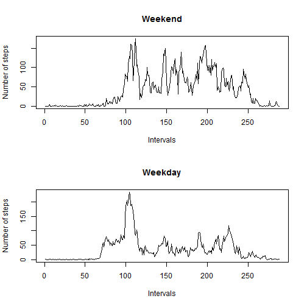

The goal of this project is to look at trends in the activity pattern of one individual over the course of two months, as measured by steps taken. The first steps is to read in the data for processing (including removing missing values:


```r
setInternet2(use = TRUE) 
setwd('C:/Users/Cailey/Desktop/DataScienceCourse/05 Reproducible Research/Week 2/')
step=read.csv("activity.csv")
activity<-step[complete.cases(step),]
```

Next, we want to calculate the total number of steps taken per day, plot a histogram of this, and then calculcate and report the mean and median steps taken per day:


```r
#sum steps
sum<-tapply(activity$steps, activity$date,sum)

#plot sum
hist(sum)
```

 

```r
#calculate and report mean and median
mean_sum<-mean(sum,na.rm=TRUE)
mean_sum
```

```
## [1] 10766.19
```

```r
median_sum<-median(sum,na.rm=TRUE)
median_sum
```

```
## [1] 10765
```

The next step in our analysis is to calculate plot the average number of steps in each 5-minute time interval:


```r
#calculate average number of steps per interval
five_min<-tapply(activity$steps, activity$interval, mean)

#plot average number of steps per interval
plot(five_min,type="l",xlab="Intervals", ylab="Number of steps")
```

 

Looking at the graph, we can estimate the highest number of steps occurs at the 105th 5-minute interval, on average across all days.

In the next step of our analysis, we replace missing values (NA) with an average of the mean number of steps per interval. Using this new "doctored" data, we plot a histogram, and report mean and median steps per day:


```r
#replace missing values with average
step[is.na(step)]<-mean(step$steps,na.rm=TRUE)

#make hist of total steps per day from this new data
sum_doctored<-tapply(step$steps,step$date,sum)
hist(sum_doctored)
```

 

```r
#calculate mean and median of new data
mean_sum_doctored<-mean(sum_doctored,na.rm=TRUE)
mean_sum_doctored
```

```
## [1] 10766.19
```

```r
median_sum_doctored<-median(sum_doctored,na.rm=TRUE)
median_sum_doctored
```

```
## [1] 10766.19
```

We can see that replacing the missing values with an average changes has not significantly affected the mean, median, and distribution of the data.

The last thing we want to do is look at how average number of steps differ on weekdays and weekends. We divide our data into groups according to the day of the week, and plot the average number of steps per interval:


```r
#break data into weekend and weekday
date<-as.Date(activity$date)
week<-weekdays(date)
activity_week<-cbind(activity,week)
Monday<-activity_week[activity_week$week=="Monday",]
Tuesday<-activity_week[activity_week$week=="Tuesday",]
Wednesday<-activity_week[activity_week$week=="Wednesday",]
Thursday<-activity_week[activity_week$week=="Thursday",]
Friday<-activity_week[activity_week$week=="Friday",]
Saturday<-activity_week[activity_week$week=="Saturday",]
Sunday<-activity_week[activity_week$week=="Sunday",]
weekend<-rbind(Saturday,Sunday)
weekdayz<-rbind(Monday,Tuesday,Wednesday,Thursday,Friday)

#calculate average steps on weekend and weekday
weekend_mean<-tapply(weekend$steps, weekend$interval, mean)
weekdayz_mean<-tapply(weekdayz$steps, weekdayz$interval, mean)

#plot average steps on weekend and weekday
par(mfrow=c(2,1))
plot(weekend_mean, type="l",xlab = "Intervals", ylab="Number of steps",main = "Weekend")
plot(weekdayz_mean, type="l", xlab = "Intervals", ylab="Number of steps",main ="Weekday")
```

 
